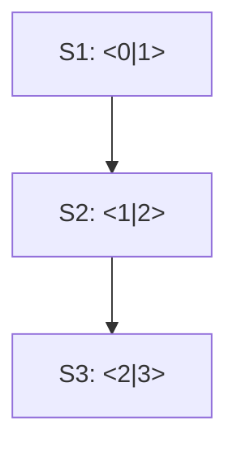
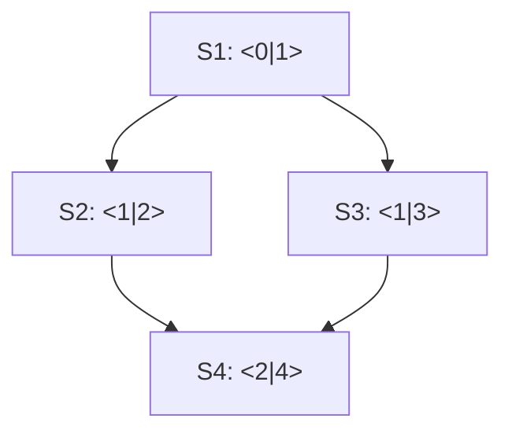
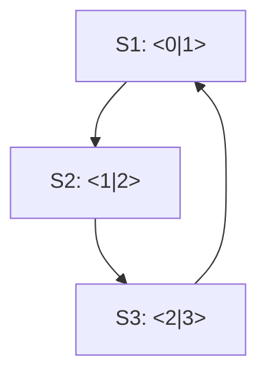
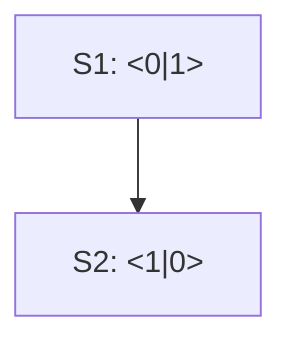
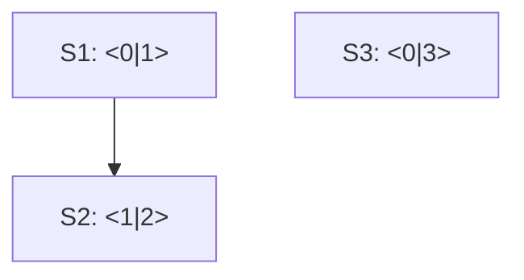
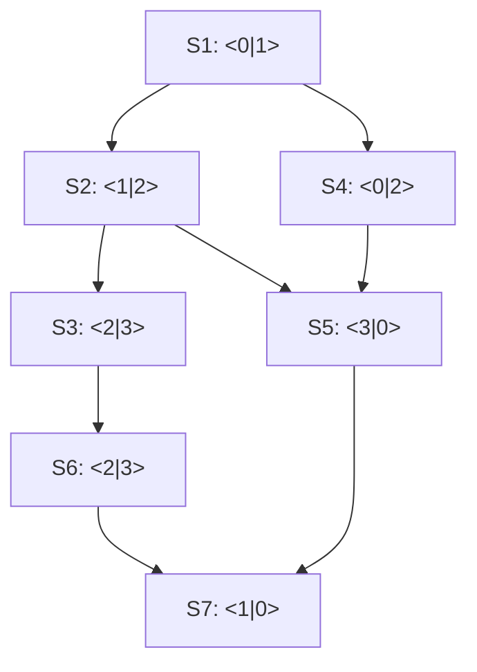

## Idea

One quickly realizes that simply enumerating all paths is not feasible, due to exponential growth.  
Further, one notices that the problem statement sounds quite similar to liveness analysis.  
Hence, my approach is to employ the same underlying tool: Data Flow Analysis.  
It is clear that we face a FORWARD & MAY analysis situation.  
If we define the different operations as follows, then the types of cargo possible to arrive at each station becomes the IN set at fixpoint.

**Abstract domain:** Sets of Cargo types

**Join:** Union
**Bottom:** Empty set  
**Top:** Set of all listed cargo types  
**Equals:** Set $A$ and $B$ are equal iff. all its elements are contained in each other

Let $n$ be a station, with $\text{cargo_off}[n]$ the cargo that is unloaded, and $\text{cargo_on}[n]$ the cargo loaded at $n$.  
Then the dataflow analysis becomes:

$$
\text{IN}[n] := \bigcup_{n' \in \text{predecessors of } n} \text{OUT}[n']
$$

$$
\text{OUT}[n] := \text{GEN}[n] \cup (\text{IN}[n] \setminus \text{KILL}[n])
$$

where

$$
\text{GEN}[n] := \text{cargo_on}[n]; \quad \text{KILL}[n] := \text{cargo_off}[n].
$$

## Examples

Arrival cargo: IN[1] = [], IN[2] = [1], IN[3] = [2]

Arrival cargo: IN[1] = [], IN[2] = [1], IN[3] = [1], IN[4] = [2, 3]

Arrival cargo: IN[1] = [3], IN[2] = [3, 1], IN[3] = [3, 2]

Arrival cargo: IN[1] = [], IN[2] = [1]

Arrival cargo: IN[1] = [], IN[2] = [1], IN[3] = []

Arrival cargo: IN[1] = [], IN[2] = [1], IN[3] = [2], IN[4] = [1], IN[5] = [2, 1], IN[6] = [3], IN[7] = [2, 1, 0, 3]